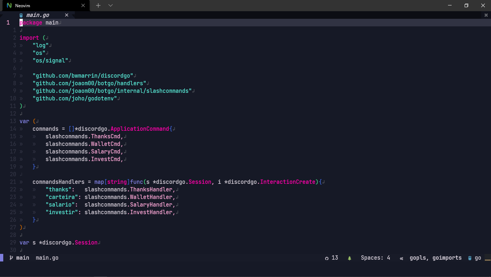

<h1 align="center">
  <br>
  
  <br>
  404 theme for <a href="https://neovim.io/">Neovim</a>
  <br>
</h1>

<p align="center">
  <strong>Neon colors inspired theme with strong variants</strong>
</p>

<p align="center">
  <a href="#install">Install</a> •
  <a href="#license">License</a>
</p>

<p align="center">
  
</p>

### Plugin Support

- [TreeSitter](https://github.com/nvim-treesitter/nvim-treesitter)
- [LSP Diagnostics](https://neovim.io/doc/user/lsp.html)
- [LSP Trouble](https://github.com/folke/lsp-trouble.nvim)
- [LSP Saga](https://github.com/glepnir/lspsaga.nvim)
- [Git Signs](https://github.com/lewis6991/gitsigns.nvim)
- [Git Gutter](https://github.com/airblade/vim-gitgutter)
- [Telescope](https://github.com/nvim-telescope/telescope.nvim)
- [NvimTree](https://github.com/kyazdani42/nvim-tree.lua)
- [WhichKey](https://github.com/liuchengxu/vim-which-key)
- [Indent Blankline](https://github.com/lukas-reineke/indent-blankline.nvim)
- [Dashboard](https://github.com/glepnir/dashboard-nvim)
- [BufferLine](https://github.com/akinsho/nvim-bufferline.lua)
- [Lualine](https://github.com/hoob3rt/lualine.nvim)
- [Lightline](https://github.com/itchyny/lightline.vim) (Soon)
- [Neogit](https://github.com/TimUntersberger/neogit)
- [vim-sneak](https://github.com/justinmk/vim-sneak)
- [Fern](https://github.com/lambdalisue/fern.vim)
- [Barbar](https://github.com/romgrk/barbar.nvim)

## Install

All instructions can be found at [INSTALL.md](./INSTALL.md).

## ⚙️ Configuration

> ❗️ configuration needs to be set **BEFORE** loading the color scheme with `colorscheme purpledaze`

| Option                  | Default | Description                                                  |
| ----------------------- | ------- | ------------------------------------------------------------ |
| purpledaze_dark_sidebar | `false` | Sidebar like windows like `NvimTree` get a darker background |

```lua
-- Example config in Lua
vim.g.purpledaze_dark_sidebar = true

-- Load the colorscheme
vim.cmd[[colorscheme purpledaze]]
```

```vim
" Example config in VimScript
let g:purpledaze_dark_sidebar = 1

" Load the colorscheme
colorscheme purpledaze
```

## License

[MIT License](./LICENSE.md)
